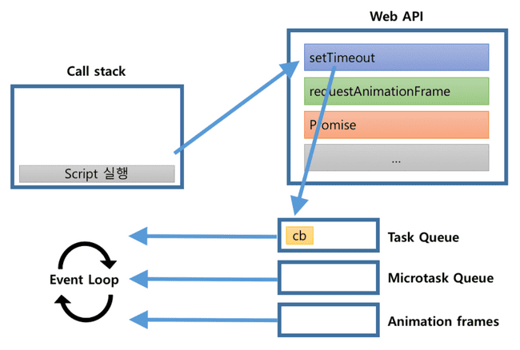

# Learn JS

### list
* [자바스크립트 비동기 처리 과정](#자바스크립트-비동기-처리-과정)
* [함수형 프로그래밍](#함수형-프로그래밍)
* [얕은 복사와 깊은 복사](#얕은-복사와-깊은-복사)
* [Iterable](#iterable)

<br/><br/>
===
<br/><br/>
## 자바스크립트 비동기 처리 과정
- 자바스크립트 처리 과정
```JavaScript
console.log("script start");
setTimeout(function() {
  console.log("setTimeout");
}, 0);
Promise.resolve().then(function() {
  console.log("promise1");
}).then(function() {
  console.log("promise2");
});
requestAnimationFrame(function {
    console.log("requestAnimationFrame");
})
console.log("script end");
```
결과
```
script start
script end
promise1
promise2
requestAnimationFrame
setTimeout
```
**자바스크립트 엔진**은 하나의 쓰레드를 가지고 있고, 멀티쓰레드 처럼 보이는 이유는 WebAPI덕분이다.
자바스크립트를 실행하면 스크립트가 stack에 올라가 작업 순서대로 Call stack에서 실행되고 난 후 삭제되는데, setTimeout, requestAniationFrame, Promise는 WebAPI에게 작업을 요청하고 Call stack에서는 삭제한다.
WebAPI에서는 callback 함수를 taskQueue에 전달하는데, setTimeout의 callback 함수는 Task Queue, Promise의 callback 함수는 Microtask Queue, 그리고 requestAnimationFrame의 callback함수는 Animation frames에 전달한다.
그 후 자바스크립트의 Call stack이 비어있으면 Event Loop가 Microtask Queuem - requestAnimationFrame - Task Queue의 순으로 그 안의 작업을 순차적으로 Call stack에 불러와 자바스크립트는 시행한다.



<br/><br/>
**Reference**<br/>
https://jakearchibald.com/2015/tasks-microtasks-queues-and-schedules/ <br/>
https://sculove.github.io/post/javascriptflow/
<br/><br/><br/>
▲ [Top](#list)
<br/><br/>
## 함수형 프로그래밍
- 순수함수
```JavaScript
function func(a, b) {
  return a + b;
}
console.log(func(2, 2)); // 4
```
입력값이 2, 2이면 언제나 리턴되는 값은 4!
또한 다른 외부 변수를 변경하는 등 영향을 주지 않음.
<br/><br/> 

- 순수하지 않은 함수
```JavaScript
let c = 1;
function func(a, b) {
  return a + b + c;
}
console.log(func(2, 2)); // 5

c = 2; 
console.log(func(2, 2)); // 6
```
동일한 입력에 다른 출력
<br/><br/> 

```JavaScript
let c = 1;

function func(a, b) {
  c += 1; // 외부의 값(변수)에 변화를 주며, 이를 부수효과라 함
  return a + b;
}

func(2, 2); // 함수 실행
console.log(c); // c 값이 2로 변화됨
```
외부 변수를 변경 - 부수효과
<br/><br/> 

```JavaScript
let obj = {
  a: 1
};

function func(obj) {
  return obj; // 인자로 받은 객체를 그대로 리턴
}

let obj2 = func(obj); // 새로운 변수에 리턴된 객체를 할당

obj2.a = 2; // 새로운 객체 obj2의 a 값을 변경

console.log(obj2); // { a: 2 }
console.log(obj); // { a: 2 }
```
func 함수를 실행하여 새로운 변수에 리턴받은 객체를 할당했으며, 새로운 객체 obj2의 a 값을 변경하였다. 그랬더니 기존의 obj 객체의 값도 변경이 되었다. 바로 객체의 참조(주소) 값도 같이 복사되어 새롭게 만든 obj2가 변화함에 따라 기존의 obj 객체도 변경되기 때문이다. 이처럼 함수 내에서 직접 값을 변경하지 않았더라도 함수에 들어온 인자값을 그대로 사용하면 순수 함수가 아니다.

<br/><br/>
▲ [Top](#list)

<br/><br/>
## 얕은 복사와 깊은 복사

<br/><br/>
**Reference**<br/>
[깊은 복사와 얕은 복사에 대한 심도있는 이야기](https://medium.com/watcha/%EA%B9%8A%EC%9D%80-%EB%B3%B5%EC%82%AC%EC%99%80-%EC%96%95%EC%9D%80-%EB%B3%B5%EC%82%AC%EC%97%90-%EB%8C%80%ED%95%9C-%EC%8B%AC%EB%8F%84%EC%9E%88%EB%8A%94-%EC%9D%B4%EC%95%BC%EA%B8%B0-2f7d797e008a) <br/>
<br/><br/><br/>
▲ [Top](#list)
<br/><br/>

## Iterable
반복 가능 객체(iterable object)는 for...of 구문과 함께 ES2015에서 도입되었으며, 다른 객체와의 차이점은 ```Symbol.iterator``` 속성에 특별한 형태의 함수가 들어있다는 것이다.
즉, 반대로 말해 객체의 ```Symbol.iterator``` 속성에 특정 형태의 함수가 들어있다면 iterable object 혹은 iterable 이라 부르고, 해당 객체는 iterable protocol을 만족한다고 말한다.
```javascript
const str = 'hello';
str[Symbol.iterator]; // [Function]
```
iterable object를 만드는 내장된 생성자는 다음과 같다.
- String
- Array
- TypeArray
- Map
- Set

iterable object는 다음과 같은 기능을 사용 할 수 있다.
```javascript
// [for...of] 루프
for (let c of 'hello') {
  console.log(c);
}

// spread 연산자
const characters = [...'hello'];

// 분해대입(destructuring assignment)
const [c1, c2] = 'hello';

// `Array.from`은 iterable 혹은 array-like 객체를 인수로 받는다.
Array.from('hello');
```
<br/>
다음과 같이 Generator 함수를 이용하여 iterable object를 구현할 수 있다.

```javascript
// '*'을 붙여서 generator 함수를 선언하고, yield 라는 키워드 뒤의 값들을 순서대로 넘겨준다.
function* numberGen() {
  yield 1;
  yield 2;
  yield 3;
}

function* numberGen2() {
  yield* numberGen();
  yield* numberGen();
}

// 1, 2, 3, 1, 2, 3이 순서대로 출력된다.
for (let n of numberGen2()) {
  console.log(n);
}

// 등차수열 생성하기
function* range(start = 0, end = Infinity, step = 1) {
  for (let i = start; i < end; i += step) {
    yield i;
  }
}

// 피보나치 수열 생성하기
function* fibonacci(count = Infinity) {
  let x = 1;
  let y = 1;
  for (let i = 0; i < count; i++) {
    yield x;
    [x, y] = [y, x + y];
  }
}

// 하나의 항목을 계속 넘겨주기
function* repeat(item, count = Infinity) {
  for (let i = 0; i < count; i++) {
    yield item;
  }
}

// 여러 요소를 반복해서 넘겨주기
function* repeatMany(array) {
  while (true) {
    for (let item of array) {
      yield item;
    }
  }
}
```

<br/><br/>
**Reference**<br/>
[ Hello World JavaScript - Iterable](https://helloworldjavascript.net/pages/260-iteration.html) <br/>
<br/><br/><br/>
▲ [Top](#list)
<br/><br/>
